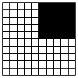

<<<<<<< HEAD
<style type="text/css">
  body{
  font-family: Helvetica;
}
</style>

*Note: This page is a copy of a [Google Sites page](https://sites.google.com/site/hongseongyun/seg) that was last updated on 6 November 2014. The instructions below apply only to versions prior to 0.6.0.*


# Introduction

The `seg` package is a collection of segregation measures developed in the geographical and sociological literature. Implemented measures range from simple, traditional methods like the index of dissimilarity (1955) to more sophisticated, spatial approaches such as Reardon and O'Sullivan's spatial segregation measures (2004). 

If you think I have missed any important methods in the field, or if you have any suggestions or new ideas to make existing features better, please do not hesitate to email me at hong.seongyun [at] gmail.com.

Reported bugs will be fixed as soon as possible. All other suggestions will be considered when preparing for the next update. Please note however that I work on this package mainly in my spare time, so updates may not be as frequent as I would like. My aim is to have at least two updates every year (one in May and the other in November).

This page demonstrates the use of `dissim()`, `isp()` and `spseg()` for computing Duncan & Duncan's D, Morrill's D(adj), Wong's D(w) and D(s), White's SP, and Reardon and O'Sullivan's spatial segregation measures. The latest version of seg is available to download from CRAN: http://cran.r-project.org/web/packages/seg/


# Hypothetical patterns of segregation

The seg package contains a sample data set of eight different distributions of the population for testing purpose. The data set itself is a simple data frame but it can be displayed on a 10-by-10 grid to reproduce the hypothetical segregation patterns used by Morrill (1991) and Wong (1993).

```r
library(seg)
# Load the sample data set into the current workspace
data(segdata)

# Create a 10-by-10 grid to display the data set
grd <- GridTopology(cellcentre.offset=c(0.5,0.5),
                    cellsize=c(1,1), cells.dim=c(10,10))
grd.sp <- as.SpatialPolygons.GridTopology(grd)

# Display the eight different patterns on one page
par(mfrow = c(2, 4), mar = c(0, 1, 0, 1))
for (i in 1:8) {
  idx <- 2 * i
  full <- segdata[,(idx-1)] == 100
  half <- segdata[,(idx-1)] == 50
  plot(grd.sp)
  plot(grd.sp[full,], col = "Black", add = TRUE)
  if (any(half))
    plot(grd.sp[half,], col = "Grey", add = TRUE)
  text(5, 11.5, labels = paste("segdata[,", idx-1, ":", idx, "]", sep = ""))
}
```

# Index of dissimilarity, D, and its spatial counterparts

The index of dissimilarity, D, and its spatial counterparts, D(adj), D(w), and D(s) can be calculated in two ways. One is by using the function seg(), and the other is by using the function dissim(). For D, which is insensitive to the spatial arrangements of spatial units (e.g., census tracts), there are practically no differences between these two functions. Both functions require a data frame with two columns, each of which represents a population group, as an input.

```r
seg(data = segdata[,1:2])
# [1] 1
dissim(data = segdata[,1:2])
# $d
# [1] 1
# 
# $dm
# [1] NA
# 
# $dw
# [1] NA
# 
# $ds
# [1] NA
# 
# $user
# [1] NA
```

The difference arises when we need to calculate its spatial associates proposed by Morrill (1991) and Wong (1993). For example, if you want to adjust D as suggested by Morrill (1991), you should first construct a rook-based, binary contiguity matrix for the study region (where 1 indicates "connected" and 0 "not connected) and standardise it by the total number of neighbours. The function seg() asks you to do this. In R, you can use poly2nb() and nb2mat() in package spdep to create such matrices.

```r
library(spdep)

# Create a rook-based (queen = FALSE), binary (style = "B") contiguity matrix
grd.nb <- nb2mat(poly2nb(grd.sp, queen = FALSE), style = "B")

# Standardise the matrix
grd.nb <- grd.nb / sum(grd.nb)

# Call seg() with an optional argument 'nb'
seg(data = segdata[,1:2], nb = grd.nb)
# [1] 0.9444444
```

This is not difficult; it requires only a couple of lines. However, this can be annoying if you have to repeat it many times. The function dissim() is a shortcut function that runs the above code for you (provided that all the necessary libraries are already installed on your machine). If you have the spdep package in R, for example, you can get something like this:

```
dissim(x = grd.sp, data = segdata[,1:2], adjust = TRUE, p2n.args = list(queen = FALSE), n2m.args = list(style = "B"))
# $d
# [1] 1
#
# $dm
# [1] 0.9444444
#
# $dw
# [1] NA
#
# $ds
# [1] NA
#
# $user
# [1] NA
```

NAs indicate that the required libraries are not available on your machine. For Wong's D(w) and D(s), we need two additional R packages, rgdal and spgrass6, and GRASS GIS, an open-source GIS software.

D(w) is essentially the same as D(adj), in the sense that it adjusts D to reflect the spatial arrangements of areal units. If two adjacent census tracts have very different population compositions, say, 100% Dwarves in one unit and 100% Hobbits in the other, it will decrease the D value slightly. If most of the neighbouring pairs in your data have completely different demographic structures, as shown in the checkerboard-like pattern above (i.e., segdata[,5:6]), the original D value will be substantially reduced.

So why do we need extra tools for calculating D(w) (and D(s) as you will see later)? The difference between D(adj) and D(w) is that the former treats all pairs of neighbours equally while the latter considers those with longer shared boundaries more important. As such, we should know the shared boundary lengths between areal units to calculate D(w).

In R, this is do-able but is not an easy task. See https://stat.ethz.ch/pipermail/r-sig-geo/2005-October/000611.html and https://stat.ethz.ch/pipermail/r-sig-geo/2005-October/000617.html. We use GRASS GIS and the additional libraries to get this geometrical information. With seg(), you need to go through several steps to get D(w):

1. Use vect2neigh() in package spgrass6 to get the shared boundary lengths
2. Put them into a matrix
3. Divide the values in the matrix by the total shared boundary length
4. Use the standardised matrix as 'nb'

```r
library(spgrass6); library(rgdal)

# Run GRASS in the current R session. Change the path (in red) to where you
# installed GRASS GIS. Don't need this if you started R within GRASS
initGRASS("C:/Program Files (x86)/GRASS 6.4.1", home = tempdir())

rownames(segdata) <- paste("g", 1:100, sep = "")
grd.df <- SpatialPolygonsDataFrame(grd.sp, segdata)
writeVECT6(grd.df, vname = "grdGRASS", v.in.ogr_flags = "o")

# (1) Get the shared boundary lengths
sl <- vect2neigh(vname = "grdGRASS", units = "me")

# (2) Put them into a matrix
sl.mat <- listw2mat(sn2listw(sl))

# (3) Globally standardise the matrix
sl.mat <- sl.mat / sum(sl.mat)

# (4) Calculate D(w)
seg(segdata[,1:2], nb = sl.mat)
```

D(s) uses the perimeter/area ratio of the units for the adjustment. The areas of the units are already stored in your SpatialPolygons object. The perimeters can be obtained using vect2neigh(). Note that the boundary of the study region is not counted towards the calculation of the perimeters. See p. 566 in Wong (1993) for an explanation.

```r
A <- unlist(lapply(slot(grd.sp, "polygons"), function(z) slot(z, "area")))
P <- attr(sl, "total") - attr(sl, "external")
PAR <- P/A
maxPAR <- max(PAR)

PAR.mat <- matrix(NA, nrow = length(PAR), ncol = length(PAR))
for (i in 1:length(PAR)) {
  for (j in 1:length(PAR))
    PAR.mat[i,j] <- ((PAR[i] + PAR[j])/2) / maxPAR
}

seg(segdata[,1:2], nb = sl.mat * PAR.mat)
```

As mentioned above, the function dissim() is a wrapper function that calls seg() with the extra code above, so the adjustment is made automatically. All you have to do is to make sure that you have the necessary libraries installed.

```r
library(spgrass6); library(rgdal)
initGRASS("C:/Program Files (x86)/GRASS 6.4.1", home = tempdir())

dissim(x = grd.sp, data = segdata[,1:2], adjust = TRUE, p2n.args = list(queen = FALSE), n2m.args = list(style = "B"))
# $d
# [1] 1
#
# $dm
# [1] 0.9444444
#
# $dw
# [1] 0.9444444
#
# $ds
# [1] 0.9472222
#
# $user
# [1] NA
```

The table below compares the segregation values in the original article to the ones from the function dissim().

| Pattern    | D          | D(adj)     | D(w)       | D(s)       | D[^1]      | D(adj)[^1] | D[^2]      | D(adj)[^2] | D(w)[^2]   | D(s)[^2]   |
|------------|------------|------------|------------|------------|------------|------------|------------|------------|------------|------------|
|  | 1.00       | 0.94       | 0.94       | 0.95       | 1.00       | 0.94       | 1.00       | 0.94       | 0.94       | 0.95       |
|  | 1.00       | 0.94       | 0.94       | 0.95       | 1.00       | 0.94       | 1.00       | 0.94       | 0.94       | 0.95       |
|            | 1.00       | 0.94       | 0.94       | 0.95       | 1.00       | 0.94       | 1.00       | 0.94       | 0.94       | 0.95       |
|            | 1.00       | 0.94       | 0.94       | 0.95       | 1.00       | 0.94       | 1.00       | 0.94       | 0.94       | 0.95       |
|            | 1.00       | 0.94       | 0.94       | 0.95       | 1.00       | 0.94       | 1.00       | 0.94       | 0.94       | 0.95       |
|            | 1.00       | 0.94       | 0.94       | 0.95       | 1.00       | 0.94       | 1.00       | 0.94       | 0.94       | 0.95       |
|            | 1.00       | 0.94       | 0.94       | 0.95       | 1.00       | 0.94       | 1.00       | 0.94       | 0.94       | 0.95       |
|            | 1.00       | 0.94       | 0.94       | 0.95       | 1.00       | 0.94       | 1.00       | 0.94       | 0.94       | 0.95       |
|            | 1.00       | 0.94       | 0.94       | 0.95       | 1.00       | 0.94       | 1.00       | 0.94       | 0.94       | 0.95       |
|            | 1.00       | 0.94       | 0.94       | 0.95       | 1.00       | 0.94       | 1.00       | 0.94       | 0.94       | 0.95       |
|            | 1.00       | 0.94       | 0.94       | 0.95       | 1.00       | 0.94       | 1.00       | 0.94       | 0.94       | 0.95       |


[^1]: Morrill
[^2]: D

For more details see [Basic writing and formatting syntax](https://docs.github.com/en/github/writing-on-github/getting-started-with-writing-and-formatting-on-github/basic-writing-and-formatting-syntax).
